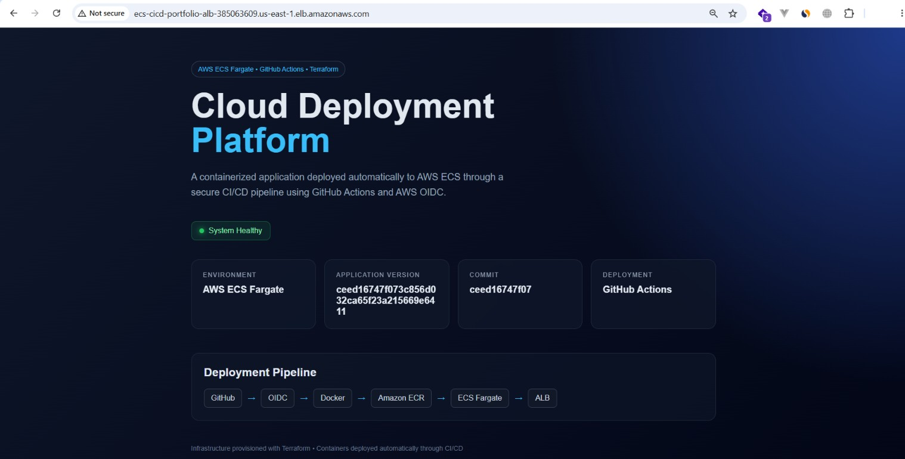

## CI/CD Pipeline

This project uses GitHub Actions with AWS OIDC authentication to deploy the application without storing long-lived AWS credentials in GitHub.

Deployment flow:

Git Push → GitHub Actions → AWS OIDC → Docker Build → Amazon ECR → Amazon ECS Fargate → Application Load Balancer

Each deployment builds a new Docker image tagged with the Git commit SHA and performs an ECS rolling deployment.

